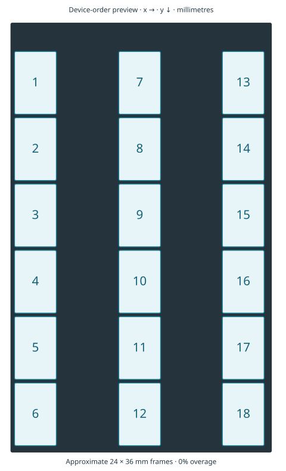

# Film holder frame selection

`v800-35mm` is the Epson V800/V850 35 mm Film Strip Holder supplied with the
scanner, with three strips of six frames. Epson describes loading it in the
[V800/V850 user guide](https://files.support.epson.com/docid/cpd4/cpd41530/source/scanners/source/placing_originals/tasks/placing_filmstrips_pv800_v850.html).

Both `scan` and `preview` accept a holder and 1-based frame numbers or ranges
instead of `--rect`. The holder supplies the source, so `--source` can be omitted:

```sh
epscan preview --holder v800-35mm --frame 1 --overage 5 --basename captures/check
epscan scan --holder v800-35mm --frame "1-5,8-12" --overage 5 --dpi 3200 --basename captures/film
```

`--holder` and `--frame` require each other. They cannot be combined with
`--rect`; `--overage` also cannot accompany `--rect`. Explicit
`--source film-holder` is allowed with this holder, but a conflicting source is rejected.
Frame numbers are positions in the holder, not exposure numbers printed on film.

Selections combine individual numbers and inclusive ascending ranges separated
by commas. For example, `1-5,8-12` selects ten frames; `3,1-3,8` produces results for
frames 3, 1, 2, and 8 in that order. Duplicates are included once. Zero, reversed ranges,
and frame numbers outside the registered layout are rejected. The entire
selection and every pass are validated before any scan or output file is started.

Each holder frame gets its own image and sidecar. With `--basename captures/film`,
frame 1 produces `film_frame01_1.tiff` and `film_frame01_1.json`; the final number
advances to avoid replacing an existing capture. This naming also applies to a
single selected holder frame. A single explicit `--rect` keeps the original
`film_1.tiff` naming; multiple explicit areas use `film_area01_1.tiff`, and so on.
The batch stops on its first failure or cancellation and retains available raw
payloads and acquisition traces, including completed frames and shared strips. Default
intermediate cleanup runs only after the entire batch succeeds;
`--keep-intermediates` retains them on success too.

Completion summaries remain the default. `--json` keeps the existing result
shape for one frame; multiple frames produce one object containing
`{"frames":[{"frame":1,"result":{...}},...]}` in the requested order. JSON is
printed only after full success. A failed batch reports an error and a nonzero
exit code; individual capture sidecars retain its recorded results.

Single-pass RGB or grayscale scans and previews automatically combine multiple selected
frames from the same registered continuous strip into one acquisition. For the
V800 holder, strip 1 contains frames 1–6, strip 2 frames 7–12, and strip 3 frames
13–18. The scanner captures only the bounding region needed for that strip's
selected frames, including the gaps between them. For example, selecting `1,3`
also acquires the intervening region, but produces only frame 1 and frame 3
outputs. Different strips are acquired in the order first encountered in the
selection; frame summaries and combined JSON retain the requested frame order.

Each frame's overage is applied before grouping. Extraction copies its exact
planned pixel rectangle from the shared raw payload, preserving sample values,
depth, and scanner alignment without resizing. `--measure-sharpness` scores
each extracted frame independently; holder gaps do not contribute to that
frame's score. Every selected frame still receives a separate TIFF and JSON
sidecar, or a raw payload and JSON with `--raw-only`.

A shared acquisition also keeps a provenance sidecar such as
`film_strip01_1.json`. Each derived frame records its source capture and crop
coordinates. After all requested acquisitions, extractions, exports, and frame
cleanup succeed, the shared raw payload and protocol trace are removed and the
source sidecar records their removal. `--keep-intermediates` retains those files;
an acquisition or extraction failure retains them for diagnosis. A strip with
only one selected frame uses the usual direct frame capture. Jobs with IR or
thumbnail passes remain separate per frame.

The intended workflow is a fixed rectangle centered on each expected frame,
with `--overage` capturing extra surrounding film for a later crop.
Epscan does not detect exposure edges or adjust the layout to each loaded strip.
For example, use `--overage 10 --gamma device-default` to add a centered margin
without uploading a custom tone table. The 2026-09-25 loaded-film preview showed
all eighteen images, with some variation in placement between strips. The layout
does not adapt to that variation.

Overage is the signed percentage change to each **total dimension**, centered on the
nominal frame. Thus 5% expands a 24 x 36 mm frame to 25.2 x 37.8 mm, adding
0.6 mm on each horizontal edge and 0.9 mm on each vertical edge. Negative values
crop instead: `--overage -10` reduces that frame to 21.6 x 32.4 mm, removing
1.2 mm from each horizontal edge and 1.8 mm from each vertical edge. The frame
center stays fixed in both cases. Overage defaults to zero and must be finite
and greater than -100%; -100% and smaller values are rejected. The resulting
dimensions must remain positive and large enough for the normal pixel alignment.
A region outside the scanner source is rejected rather than clipped. Large
positive overage can include
the holder mask or neighboring frames. The scanner's usual pixel alignment still
applies; requested and effective rectangles are recorded in the metadata.

For placement adjustments, both commands also accept one or more explicit
rectangles with a required source, for example:

```sh
epscan scan --source film-holder --rect "10,30,10,10;70,70,10,10" --dpi 3200 --measure-sharpness --basename captures/details
```

Each area is `x,y,width,height` in millimetres relative to that source; separate
areas with semicolons inside the quoted argument. Quotes keep PowerShell from
treating the semicolon as a command separator. A single area uses the same
syntax, such as `--rect "10,30,40,80"`; the old four-separate-value syntax is no
longer accepted. Explicit rectangles cannot be mixed with holder, frame or
overage selection.

All explicit areas and passes are validated before capture. Nearby vertical
regions share one bounding-box scan when they overlap horizontally by at least
half the narrower width and their vertical gap is at most 10 mm. Larger gaps and
separate columns remain separate scans. Outputs retain the supplied order,
including repeated identical rectangles, with the same failure and cleanup policy
as holder batches. `--measure-sharpness` scores each area separately.
Single-area JSON keeps the existing result shape; multiple
areas use `{"areas":[{"area":1,"result":{...}},...]}`, while holder batches keep
the `frames` shape described above.

## V800-family 35mm holder



The layout is numbered top to bottom down each strip, then left to right across
the **unrotated, unmirrored device-order preview**: 1–6, 7–12, 13–18. Align the
holder arrows with the scanner arrows as shown in [Epson's placement guide](https://files.support.epson.com/docid/cpd4/cpd41530/source/scanners/source/placing_originals/tasks/placing_filmstrips_pv800_v850.html).

A 100-DPI preview of the user's empty holder on the GT-X980/B8 was acquired on
2026-09-25 with the film-holder source, rectangle 0,0,149.86,246.38 mm. The output
was 584 x 970 pixels (width aligned to eight pixels). The three clear openings
were approximately 24.5 x 228.5 mm. Their measured centers set the horizontal
positions below. The initial layout centered six nominal 24 x 36 mm frames on a
38 mm pitch vertically in each opening, with the first row at y=18.5 mm.

The current layout starts at approximately y=16.5 mm and retains the 38 mm pitch.
All eighteen rectangles are shifted 2 mm toward the source origin to align with
the currently loaded film, following the 2026-09-25 live 100- and 150-DPI preview
comparison in `captures/negpy-holder-debug-20260925`. Horizontal positions and
frame dimensions are unchanged. Coordinates are rounded to 0.1 mm; this alignment
does not establish exposure registration for every loaded strip.

These are **approximate holder positions**, not detected film-image boundaries.
The empty-holder measurement cannot establish where a particular cut strip's
first exposure begins. Use padding and downstream cropping to accommodate strip
placement; `--rect` remains available for individual placement adjustments. Mounted slides, 120 and 4x5
holders are not registered until their layouts have been measured.

All values below are **x, y, width, height in millimetres**, relative to the
film-holder source origin:

| Frame | x | y | Width | Height |
| --- | ---: | ---: | ---: | ---: |
| 1 | 2.3 | 16.5 | 24 | 36 |
| 2 | 2.3 | 54.5 | 24 | 36 |
| 3 | 2.3 | 92.5 | 24 | 36 |
| 4 | 2.3 | 130.5 | 24 | 36 |
| 5 | 2.3 | 168.5 | 24 | 36 |
| 6 | 2.3 | 206.5 | 24 | 36 |
| 7 | 62.1 | 16.5 | 24 | 36 |
| 8 | 62.1 | 54.5 | 24 | 36 |
| 9 | 62.1 | 92.5 | 24 | 36 |
| 10 | 62.1 | 130.5 | 24 | 36 |
| 11 | 62.1 | 168.5 | 24 | 36 |
| 12 | 62.1 | 206.5 | 24 | 36 |
| 13 | 121.5 | 16.5 | 24 | 36 |
| 14 | 121.5 | 54.5 | 24 | 36 |
| 15 | 121.5 | 92.5 | 24 | 36 |
| 16 | 121.5 | 130.5 | 24 | 36 |
| 17 | 121.5 | 168.5 | 24 | 36 |
| 18 | 121.5 | 206.5 | 24 | 36 |

The implementation table is in `src/capabilities.rs`. `epscan dump` includes
registered layouts in `model_profile.holders`. Rust callers can resolve a
rectangle with `ScannerModel::holder_frame(Holder::V800Film35mm, frame, overage)`;
`ScanOptions::holder_selection` records the choice and validates its agreement
with `ScanSettings`. Sidecar and image metadata include the holder, frame,
overage, nominal rectangle, and adjusted rectangle.

The local calibration capture is
`captures/holder-calibration-20260925/full-holder_1.tiff`; captures are ignored by
Git. The diagram shows the registered rectangles; it is not a claim of detected
image content or measured film registration.

Hardware checks on 2026-09-25, using the initial y=18.5 mm layout, completed frame
1 as a 100-DPI preview at 0% overage, frame 8 as a 300-DPI RGB16 scan at 5%, and
frame 18 as a 100-DPI preview at 10%. All recorded the selected holder/frame and
retained TIFF plus sidecar after cleanup.

Repeated full-holder and frame-18 previews from those checks exposed a positioning limitation:
the opening's bottom edge appears at full-preview row 966, but at cropped row
144 plus requested origin 814 = 958. The eight-row difference is about 2.03 mm
at 100 DPI. Regular RGB8 scans after a power cycle, using `--gamma device-default`,
placed the same bottom edge at command-space 243.459 mm (100 DPI) and 243.544 mm
(300 DPI), versus 245.491 mm in the full preview. A separate top-edge crop starting
at y=10 mm aligned within one 100-DPI pixel, so a constant two-millimetre shift
would not fit both ends. Requested and read-back coordinates agree, and TIFF
sample hashes match acquisition hashes. The cause was not established, and these
checks did not yield a blanket offset correction. The current 2 mm layout shift
aligns the rectangles with the loaded film; it is not a correction for that
unresolved acquisition difference. Use padded approximate captures, with precise
cropping performed downstream.

One additional RGB8 test using the identity LUT failed before acquisition when
the blue gamma-table upload returned STX instead of ACK. The subsequent identity
query also failed. After the user power-cycled the scanner, the two regular
RGB8 scans above passed using device-default gamma. This holder work does not
resolve that protocol failure; its trace and empty partial payload were retained.
